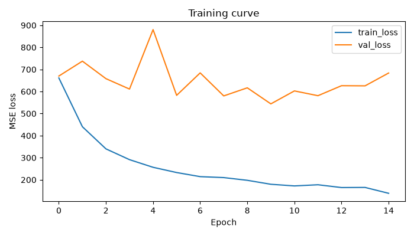

# Steering Angle Prediction (CNN + LSTM)

Predicts a car's steering angle from sequences of driving-camera frames,
using a pretrained CNN backbone (frozen ImageNet weights) feeding a
from-scratch LSTM. Trained on the
[steering_dataset](https://www.kaggle.com/datasets/phamvoquoclong/steering-dataset)
(Kaggle, phamvoquoclong).

---

## Architecture

```
Frame sequence (T frames)
        │
        ▼
ResNet18 backbone (pretrained on ImageNet, frozen)
        │  per-frame feature vectors
        ▼
LSTM (1 layer, trained from scratch)
        │  temporal context
        ▼
Fully connected head
        │
        ▼
Predicted steering angle (last frame)
```

The CNN supplies generic visual features (edges, lane markings, road
texture) transferred from ImageNet and is kept frozen. The LSTM learns the
temporal, driving-specific dynamics on top of those features, since there's
no meaningful pretrained model for that part. A small fully-connected head
regresses the final steering angle from the LSTM's last hidden state.

---

## Project structure

```
.
├── download_dataset.py     # Pulls the Kaggle steering-dataset via kagglehub
├── convert_txt_to_csv.py   # Converts the dataset's data.txt into driving_log.csv
├── dataset.py               # Builds sliding-window frame sequences from the CSV
├── model.py                 # CNNEncoder (ResNet18/MobileNetV2) + LSTM + regression head
├── train.py                 # Training loop: metrics, early stopping, loss curve plot
├── metrics.py                # MAE / RMSE (degrees) + straight-vs-turn error breakdown
├── visualize.py              # Draws the predicted (and ground-truth) angle on frames/video
├── loss_curve.png            # Train/val loss over epochs from the most recent run
└── requirements.txt
```

---

## Setup

```bash
python -m venv venv
source venv/bin/activate      # Windows: venv\Scripts\activate
pip install -r requirements.txt
```

---

## Data pipeline

### 1. Download the dataset

```bash
python download_dataset.py
```

This uses `kagglehub` to download `phamvoquoclong/steering-dataset` and
prints the local path it was extracted to.

### 2. Convert the raw labels to CSV

The raw dataset ships a `data.txt` with space-separated lines like:

```
99576.jpg -66.250000
```

Convert it into the CSV format `dataset.py` expects
(`image_path,steering_angle`):

```bash
python convert_txt_to_csv.py --txt data.txt --out driving_log.csv
```

Malformed lines (wrong number of fields, non-numeric angle) are skipped
with a warning rather than stopping the conversion; the script reports how
many rows were written vs. skipped when it finishes.

### 3. Expected CSV format

```
image_path,steering_angle
center_0001.jpg,-0.023
center_0002.jpg,-0.019
...
```

Images must be listed **in temporal (recorded) order**. If your CSV uses
different column names, edit `IMAGE_COL` / `ANGLE_COL` at the top of
`dataset.py`.

Train/val splitting (`make_train_val_split` in `dataset.py`) is done **by
time**, not randomly — random shuffling would leak near-duplicate adjacent
frames across both splits and produce a misleadingly low validation loss.

> **Angle units:** this dataset (`phamvoquoclong/steering-dataset`) stores
> `steering_angle` in **degrees** (e.g. `-66.25`), which is why
> `metrics.py` sets `RAD_TO_DEG = 1.0`. If you swap in a dataset that
> stores radians instead, update that constant.

---

## Training

```bash
python train.py \
    --csv driving_log.csv \
    --img_dir data/images \
    --epochs 30 \
    --batch_size 16 \
    --seq_len 5 \
    --backbone resnet18 \
    --patience 5
```

Key flags:

| Flag | Default | Description |
|---|---|---|
| `--seq_len` | 5 | Number of frames per input sequence |
| `--backbone` | resnet18 | `resnet18` or `mobilenet_v2` |
| `--patience` | 5 | Early stopping: epochs without val_loss improvement before stopping |
| `--min_delta` | 1e-5 | Minimum val_loss improvement to count as progress |
| `--turn_threshold_deg` | 5.0 | Angle (deg) separating "straight" vs "turn" frames in metrics |

Outputs:
- `steering_model_best.pt` — best checkpoint by validation loss
- `loss_curve.png` — train/val loss over epochs
- Per-epoch console log with MAE, RMSE, and straight-vs-turn MAE (all in degrees)

---

## Metrics

Reported every epoch, in **degrees** for interpretability
(`metrics.py`):

- **MAE / RMSE** — overall prediction error.
- **Straight MAE vs. Turn MAE** — splits error on near-zero-angle
  ("straight") frames from sharp-turn frames, using `turn_threshold_deg`
  (default 5°). Overall MAE alone can look deceptively good even when a
  model just predicts ~0 for everything, since most driving frames are
  straight; this breakdown catches that failure mode.

## Results



Loss shown is **MSE** on the raw degree-valued angle (not yet converted
via `metrics.py`), tracked over 15 epochs:

| | Epoch 0 | Best | Epoch 14 (final) |
|---|---|---|---|
| **Train loss** | ~660 | — | **~140**, still decreasing |
| **Val loss** | ~660 | **~545** (epoch 9) | ~680 |

Reading the curve:
- **Train loss falls steadily and monotonically** from ~660 to ~140 —
  the frozen-backbone + LSTM setup is fitting the training sequences well.
- **Val loss is noisy and roughly flat-to-rising** after an early dip,
  bottoming out around epoch 9 (~545) before climbing back to ~680 by
  epoch 14, while train loss keeps falling. The widening train/val gap
  after epoch ~9 is a classic **overfitting** signature.
- Practical takeaways: checkpoint on best `val_loss` (as `train.py`
  already does) rather than the final epoch; consider stopping earlier
  (lower `--patience`), adding regularization (increase `dropout`,
  weight decay), more train-time augmentation, or more data, since the
  model is fitting the training sequences' noise faster than it's
  generalizing.

For the actual per-epoch MAE / RMSE / straight-vs-turn numbers behind a
given run, check the console log `train.py` prints — those are computed in
interpretable degrees via `metrics.py` and aren't reflected in the MSE
curve above.

---

## Visualization

`visualize.py` draws a steering-needle line on each frame: **red** for the
model's prediction, **green** for ground truth (when available), overlaid
with the numeric angle. Just edit the `CONFIG` block at the top of the
file (`MODEL_PATH`, `CSV_PATH`, `IMG_DIR`, `OUT_PATH`, etc.) and run:

```bash
python visualize.py
```

It renders every image found in `IMG_DIR` into an annotated MP4
(`OUT_PATH`), with a `tqdm` progress bar, matching ground truth by
filename against the CSV, and skipping unreadable images without stopping
the run.

<p align="center">
  
 </p>
 
---

## Notes / things to check for your specific dataset

- This project need more training to have good accuracy and output this is not enough at all but  i have limited resources
